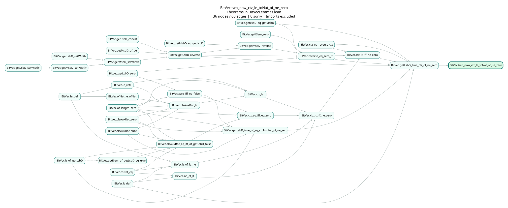

# Lean theorem dependency DAG

Inspired by LeanArchitect. Extracts theorem dependencies from a Lean source file
and marks nodes containing `sorry`.

## Example output

Dependency graph for `BitVec.two_pow_ctz_le_toNat_of_ne_zero` from Lean's
6294-line [bitvector proof file](examples/online/Online/BitVecLemmas.lean).
With `--no-sorry-only`, the graph contains 36 theorem nodes and 60 edges,
all within that file. Imported declarations are excluded.



[Open the SVG](output/bitvec_ctz/full.svg) to zoom in.

```sh
python3 lean_dag.py examples/online/Online/BitVecLemmas.lean \
  BitVec.two_pow_ctz_le_toNat_of_ne_zero \
  --no-sorry-only -o output/bitvec_ctz
```

## Run

Requires Python 3.10+ and Lean 4.26.0 installed through elan.

```sh
elan toolchain install leanprover/lean4:v4.26.0
python3 lean_dag.py examples/Incomplete.lean Demo.target -o output/demo --open
```

Outputs `graph.html`, `graph.svg`, `graph.dot`, and `graph.json`. Open
`graph.html` in a browser to view the graph offline.

For a file in another Lake project, pass its path and fully qualified theorem
name. The project root is detected automatically and must use Lean 4.26.0.

```sh
python3 lean_dag.py /path/to/project/MyProject/Result.lean MyProject.main_theorem -o output/result
```

By default, the graph keeps the root and all dependency paths to `sorry` nodes.
If no sorry is reachable, only the root remains. Use `--no-sorry-only` to export
all reachable theorem dependencies within the file.

| Option | Meaning |
| --- | --- |
| `--project PATH` | Explicit Lake project root |
| `-o PATH`, `--output-dir PATH` | Output directory, default `output` |
| `--max-nodes N` | Maximum graph size, default 10000 |
| `--timeout SECONDS` | Timeout per Lean/Lake command, default 300 |
| `--open` | Open the HTML after extraction |
| `--no-sorry-only` | Export the full dependency graph within the file |

## Reading the graph

- An edge `A -> B` means `B` uses `A`. Statement-only edges are dashed.
- Nodes represent theorems declared in the input file. Imported declarations and
  local `have` bindings are excluded.
- Automatically generated declarations without standalone source ranges, such as
  structure projections, constructor injectivity theorems, and internal proof
  helpers, are traversed without becoming nodes. Their local theorem dependencies
  and `sorry` uses still contribute to the graph. They cannot be selected as
  theorem targets because they have no standalone source proof to edit.
- Red means the theorem contains `sorry`, including through local definitions or
  internal helpers. Amber means it depends on a theorem containing `sorry`.
  Green means neither applies within the input file.

The file must elaborate successfully. Explicit `sorry` and `admit` are accepted;
unresolved goals and other Lean errors are not. The graph reflects elaborated
statements and proofs. It does not inspect sorries in imported declarations or
infer dependencies of unwritten proofs.

## Tests

```sh
python3 -m unittest discover -s tests -v
```
