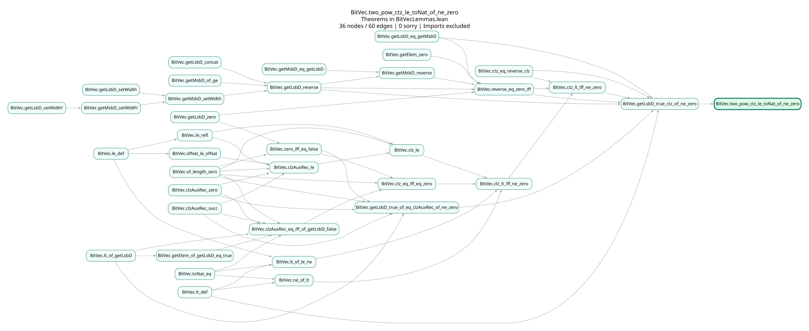

# Lean theorem dependency DAG

Inspired by LeanArchitect. Extracts theorem dependencies from a Lean source file
and marks nodes containing `sorry`.

## Example output

Dependency graph for `BitVec.two_pow_ctz_le_toNat_of_ne_zero` from Lean's
6294-line [bitvector proof file](examples/online/Online/BitVecLemmas.lean).
With `--no-sorry-only`, the graph contains 36 theorem nodes and 60 edges,
all within that file. Imported declarations are excluded.



[Open the SVG](output/bitvec_ctz/full.svg) to zoom in.

```sh
python3 lean_dag.py examples/online/Online/BitVecLemmas.lean \
  BitVec.two_pow_ctz_le_toNat_of_ne_zero \
  --no-sorry-only -o output/bitvec_ctz
```

## Run

Requires Python 3.10+ and Lean 4.26.0 installed through elan.

```sh
elan toolchain install leanprover/lean4:v4.26.0
python3 lean_dag.py examples/Incomplete.lean Demo.target -o output/demo --open
```

Outputs `graph.html`, `graph.svg`, `graph.dot`, and `graph.json`. Open
`graph.html` in a browser to view the graph offline.

For a file in another Lake project, pass its path and fully qualified theorem
name. The project root is detected automatically and must use Lean 4.26.0.

```sh
python3 lean_dag.py /path/to/project/MyProject/Result.lean MyProject.main_theorem -o output/result
```

By default, the graph keeps the root and all dependency paths to `sorry` nodes.
If no sorry is reachable, only the root remains. Use `--no-sorry-only` to export
all reachable theorem dependencies within the file.

| Option | Meaning |
| --- | --- |
| `--project PATH` | Explicit Lake project root |
| `-o PATH`, `--output-dir PATH` | Output directory, default `output` |
| `--max-nodes N` | Maximum graph size, default 10000 |
| `--timeout SECONDS` | Timeout per Lean/Lake command, default 300 |
| `--open` | Open the HTML after extraction |
| `--no-sorry-only` | Export the full dependency graph within the file |

## Reading the graph

- An edge `A -> B` means `B` uses `A`. Statement-only edges are dashed.
- Nodes represent theorems declared in the input file. Imported declarations and
  local `have` bindings are excluded.
- Automatically generated declarations without standalone source ranges, such as
  structure projections, constructor injectivity theorems, and internal proof
  helpers, are traversed without becoming nodes. Their local theorem dependencies
  and `sorry` uses still contribute to the graph. They cannot be selected as
  theorem targets because they have no standalone source proof to edit.
- Red means the theorem contains `sorry`, including through local definitions or
  internal helpers. Amber means it depends on a theorem containing `sorry`.
  Green means neither applies within the input file.

The file must elaborate successfully. Explicit `sorry` and `admit` are accepted;
unresolved goals and other Lean errors are not. The graph reflects elaborated
statements and proofs. It does not inspect sorries in imported declarations or
infer dependencies of unwritten proofs.

## Tests

```sh
python3 -m unittest discover -s tests -v
```

## 失败记录

Python 命令行或 API 执行失败时，会在本工具目录的 `failures/` 下新建一个带 UTC 时间和随机后缀的目录，保存输入 Lean 代码、已有的临时请求和结果文件，以及 `failure.json` 和 `error.txt`。提取工具还会保存已生成的 `candidate.lean`；合并工具会分别保存 `base.lean` 和 `donor.lean`。`failure.json` 包含调用参数、原始路径和错误信息，归档路径打印到 stderr。AgentProver 宿主命令失败时还会保存 `cmd`、`exit_code`、`timed_out`、`timeout`、`stdout` 和 `stderr`；异常文本包含命令、退出状态或超时原因，负退出码会显示终止信号。

成功时不创建记录。失败记录不会覆盖输入或已有输出，已加入 Git 忽略规则，可在修复后手动删除。归档写入失败时只打印提示，仍返回原始错误。AgentProver 的沙箱调用由宿主进程在同一位置保存记录；直接使用 `lean --run` 运行内部 Lean 文件不经过 Python 归档入口。

设置 `LEAN_TOOL_FAILURE_ARCHIVE=0` 可关闭失败归档。测试套件自动设置此开关，避免预期失败写入工具目录；归档功能的专用测试仅在临时目录中启用归档。

### 2026-10-02 失败排查

以下记录编号使用归档目录中的 UTC 时间。

| 记录 | 现象与判断 |
| --- | --- |
| `20260929T120432.865533Z-zkl7muf_` | `lake setup-file` 失败且异常文本为空，对应批次随后取消。相同输入通过宿主沙箱复跑成功，得到 28 个节点、52 条边。 |
| `20261001T055222.254735Z-lkv3zj_8` | `prove` 检查拒绝 `imo_2024_p3`，其证明仍是 `by sorry`。复跑确认是正常拒绝，保持公理检查；已将错误提示中的 `Refutation` 改为 `Proof`。 |
| `20261002T015826.466177Z-1n3i62af` | 提取 `imosl_2015_c6` 时异常文本为空，同一时刻运行记录标记为取消，原因为 `Proof execution stopped by request`。相同输入通过宿主沙箱复跑成功，得到 1 个含 `sorry` 的节点、0 条边，符合目标证明仍是 `by sorry` 的输入。 |

两次空错误与取消流程一致，但旧归档没有退出码，无法据此确定具体终止信号。已确认的缺陷在宿主 `dag_lean.py`：它原先仅用进程输出构造异常，无输出时就丢失失败原因。现已保留命令、退出码、超时状态和标准输出、标准错误，并在异常文本中说明失败状态。取消时仍保留归档，不把任意进程终止判定为用户取消。

验证通过：本工具 25 项测试，宿主归档与沙箱 38 项测试，以及证明、反证检查的 2 项真实 Lean 集成测试。新增回归覆盖无输出退出、空白输出、终止信号、超时和完整诊断归档。

上述三份原始归档已清理，保留的回归用例使用最小输入：

- [宿主归档测试](../../test/test_tool_failure_archives.py) 的 `test_host_archives_command_diagnostics` 覆盖 `lake setup-file` 和 `ExtractDag.lean` 两个失败阶段，并检查提取失败时仍保存已生成的 `setup.json`。补齐两个阶段后，归档测试共 34 项通过。
- [Lean 集成测试](../../test/test_dag_lean_integration.py) 的 `test_verification_rejects_unfinished_proofs_and_changed_statements` 检查 `by sorry` 被拒绝，且证明校验使用 `Proof` 错误提示。
